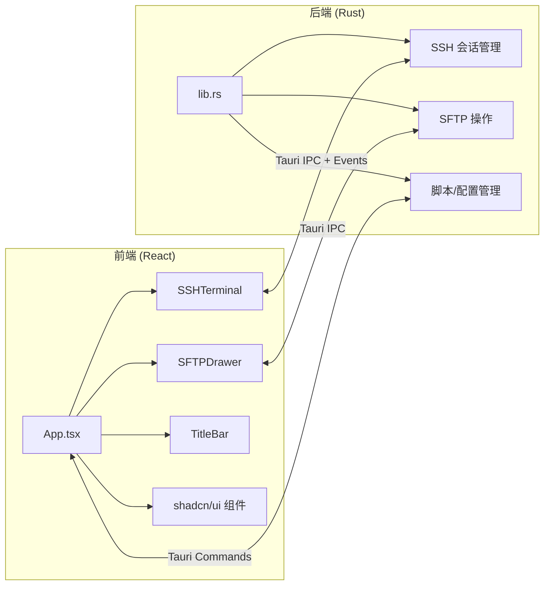

# Remoter 项目分析

## 概述

**Remoter** 是一个基于 **Tauri v2 + React 19 + TypeScript** 的跨平台桌面 SSH 客户端，提供终端连接、批量命令分发、SFTP 文件管理等功能。

| 维度 | 详情 |
|------|------|
| **应用标识** | `xyz.qc233.remoter` v0.1.0 |
| **前端** | React 19 + TypeScript + Vite 7 + TailwindCSS v4 |
| **UI 组件** | shadcn/ui (New York 风格) + Framer Motion 动画 |
| **后端** | Rust (Tauri v2) + ssh2 (vendored-openssl) |
| **终端** | xterm.js v5 + xterm-addon-fit |
| **并发** | tokio + dashmap + parking_lot |
| **包管理** | pnpm |

---

## 架构



---

## 核心功能模块

### 1. SSH 终端 (一对一模式 — `single` 页面)

- **多标签页** — 支持同时打开多个 SSH 连接，每个标签页独立的 `instanceId`
- **xterm.js 终端** — 自定义配色 (JetBrains Mono 字体)，透明背景，自适应尺寸
- **Shell 集成** — 启动时注入 OSC 7 hook (`_remoter_osc7`)，实时追踪远程 `$PWD` 变化
- **启动拦截** — 三阶段状态机：先缓冲 MOTD → 注入命令 → 过滤 sentinel `__REMOTER_SYNC_DONE__` → 正常输出
- **断线重连** — 连接断开后按 `r` 键重连
- **认证方式** — 密码认证 / SSH 密钥认证（支持 passphrase，拒绝 PuTTY `.ppk` 格式）

### 2. 批量命令分发 (一对多模式 — `multi`/FORK 页面)

- **分组管理** — 主机按组显示，支持拖拽移动到组 / 创建新组
- **全选/批量选** — 组级全选 + 单机勾选
- **命令分发** — `run_command_all` 对选中主机并行执行（每台 `tokio::spawn` + SSH 连接）
- **文件分发** — `distribute_file_data` 通过 SCP 上传文件到所有选中主机
- **状态指示** — 每台主机显示 `Idle/Running/Success/Failure` 状态 + 历史记录

### 3. SFTP 文件管理器

- **抽屉式 UI** — 从终端顶部滑出，`framer-motion` 弹性动画
- **完整文件操作** — 列目录 / 创建目录 / 重命名 / 删除文件与目录 / 上传 / 下载
- **路径同步** — 通过 OSC 7 自动跟踪终端当前目录
- **拖拽上传** — 同时支持浏览器 drag-drop 和 Tauri 原生文件拖入
- **路径编辑** — 点击路径栏可手动输入路径

### 4. 快捷脚本系统

- **模板化命令** — 支持 `$var_name` 变量占位符
- **参数弹窗** — 执行脚本前弹出参数填写对话框
- **双模式执行** — 单机模式下通过 `send_ssh_data` 写入终端；多机模式下通过 `run_command_all` 分发
- **默认脚本** — 预置 "Update System" 和 "Install Package" 两个脚本

### 5. 配置持久化

- **存储路径** — `~/.config/remoter/config.json`（明文 JSON）
- **自动迁移** — 从旧路径 (`~/.remoter/` 或 `AppData/`) 自动迁移
- **自动保存** — 每次增删改操作后立即写盘
- **数据结构** — `AppConfig { sessions, scripts, settings }`

---

## 文件结构

```
remoter/
├── src/                          # 前端源码
│   ├── App.tsx                   # 主应用 (1266 行，所有页面 + 状态逻辑)
│   ├── main.tsx                  # React 入口
│   ├── index.css                 # 全局样式 + CSS 变量
│   ├── components/
│   │   ├── SSHTerminal.tsx       # xterm.js 终端组件 (209 行)
│   │   ├── SFTPDrawer.tsx        # SFTP 文件管理抽屉 (360 行)
│   │   ├── TitleBar.tsx          # 自定义窗口标题栏 (85 行)
│   │   └── ui/                   # shadcn/ui 基础组件
│   └── lib/utils.ts              # cn() 工具函数
├── src-tauri/                    # Rust 后端
│   ├── src/
│   │   ├── lib.rs                # 所有业务逻辑 (1251 行, 26 个 Tauri 命令)
│   │   └── main.rs               # 入口
│   ├── Cargo.toml                # Rust 依赖
│   └── tauri.conf.json           # Tauri 配置 (无边框窗口, 1000x700)
├── scripts/release.sh            # 发布脚本
└── package.json                  # 前端依赖
```

---

## Tauri 命令清单 (26 个)

| 类别 | 命令 | 说明 |
|------|------|------|
| **会话管理** | `add_session`, `batch_add_sessions`, `delete_session`, `get_sessions`, `update_session_group` | 增删改查 |
| **SSH 终端** | `start_ssh_session`, `stop_ssh_session`, `send_ssh_data`, `resize_ssh_session` | PTY 交互 |
| **批量操作** | `run_command_all`, `distribute_file`, `distribute_file_data` | 命令/文件分发 |
| **脚本** | `get_scripts`, `add_script`, `delete_script` | 脚本 CRUD |
| **SFTP** | `sftp_list`, `sftp_mkdir`, `sftp_rename`, `sftp_remove_file`, `sftp_remove_dir`, `sftp_upload`, `sftp_upload_file`, `sftp_download` | 文件管理 |
| **系统** | `manual_save_to_disk` | 手动保存 |

---

## 技术亮点

1. **Shell 集成感知** — 启动时注入 OSC 7 hook 实现 CWD 追踪，SFTP 面板自动定位到终端当前目录
2. **启动拦截状态机** — 3 阶段拦截 boot 输出，过滤初始化命令噪音，仅展示纯 MOTD + 干净的提示符
3. **非阻塞 SSH I/O** — SSH session 设为 `non-blocking`，单线程 polling 同时处理读写
4. **并发安全** — 使用 `DashMap` (无锁并发哈希表) + `parking_lot::Mutex` 替代 std 锁
5. **无边框窗口** — 自定义 `TitleBar` 组件 + `data-tauri-drag-region` 实现原生拖拽
6. **窗口状态插件** — `tauri-plugin-window-state` 记住窗口位置/大小

## 潜在改进方向

| 方向 | 说明 |
|------|------|
| **代码拆分** | `App.tsx` (1266 行) 和 `lib.rs` (1251 行) 过于庞大，建议拆分为多个模块 |
| **安全性** | 密码明文存储于 JSON；建议集成系统密钥链或加密存储 |
| **错误处理** | SFTP 操作的 `WouldBlock` 重试循环缺少超时保护，可能无限阻塞 |
| **跳板机支持** | `jump_host` 字段已定义但未实现 |
| **状态管理** | 大量 `useState` 可考虑引入 Zustand 等状态管理库 |
| **测试** | 目前无单元测试或集成测试 |
